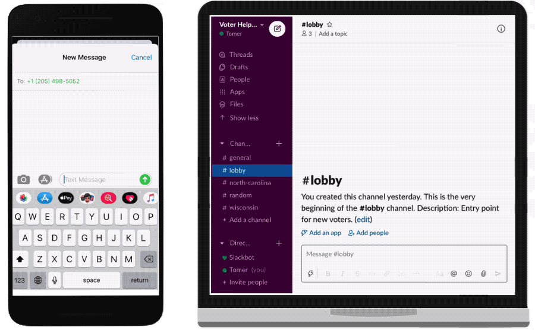
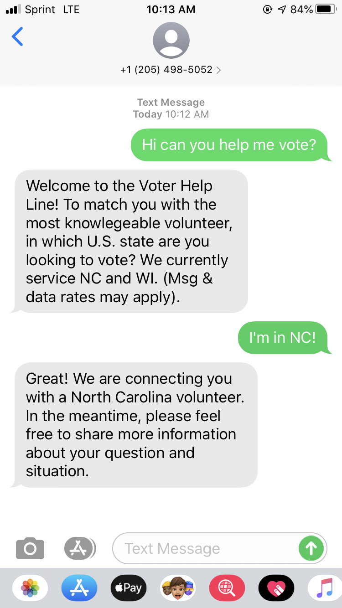
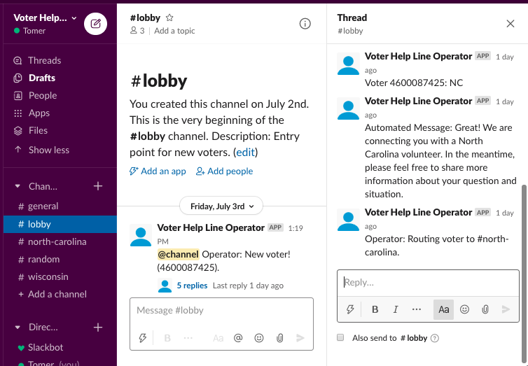

# Voter Help Line

Project that connects **voters** who need help voting with **volunteers** who want to help.

## Idea

The premises behind this project are:
- More people would **vote** if doing so took less of their time.
- People are willing to **volunteer** their time to help other people vote, if there were a convenient way for them to do so.

## Get Involved

Interested in helping people vote? Please reach out to volunteer@voterhelpline.org. We need:

1. **Volunteers** to learn voting rules, join our Slack workspace and answer voter questions.
2. **Programmers** to add additional features and make desired changes.

## Demo

Text **(984) 231-VOTE** to demo the system.

Text **(205) 498-5052** for help voting on the live system.

## Technical Overview

This technology consists of three systems:

1. [**Slack App**](https://api.slack.com/), for relaying messages to and from the Slack Workspace used by volunteers,
2. [**Twilio Programmable SMS**](https://www.twilio.com/sms), for relaying texts to and from voters, and
3. [**An Express Node.js server**](https://expressjs.com/) for passing logic between Slack and Twilio, and any additional app logic (e.g. determining U.S. state of voters). This server is deployed using [Heroku](http://heroku.com/) and uses a [Redis](https://redis.io/) in-memory database to persist some data (e.g. to look up a Slack thread given a voter phone number, and vice versa).

## Features

### Voter Experience

The system immediately greets a voter upon initial message and attempts to automatically determine the U.S. state in which a voter is seeking to vote.

If a voter is idle for a set amount of time (currently one hour), the system sends an automated message acknowledging their message and informing them that a volunteer is being sought.

### Volunteer Experience

The system routes voter messages to a Slack workspace, which serves as the interface for volunteers.

Messages in the Slack workspace are organized by:

- **U.S. state**: each U.S. state has a separate Slack channel. Given volunteers will likely answer questions in one or several states, this allows the system to handle many states while allowing volunteers to only monitor states where they can help.
- **voter**: when a new voter texts the system, a new Slack thread is created for them (in the channel according to the U.S. state in which they seek to vote). All subsequent messages from that voter are posted within that same thread, and all messages sent by Slack (from any user except the bot) to that thread are relayed as a text to the voter.

The system also manages a *#lobby* channel in the Slack workspace, where voter messages are relayed before their U.S. state is determined. This allows volunteers to monitor an incoming voter's messages as the automated system attempts to determine their U.S. state. Volunteers can intervene if a volunteer has difficulty selecting a U.S. state (or doesn't know or want to select one) by messaging in the Slack *#lobby* thread.

Once a U.S. state is determined, a thread is created for the voter in the Slack channel corresponding to that U.S. state (e.g. *#north-carolina*) and the entire chat history of the voter is re-posted to that new thread so that volunteers can see the voter's chat experience and messages up to that point.

In addition to threads in which volunteers chat with voters, each channel can be used for volunteers to chat with one another. For example, when a new thread is created in *#north-carolina* for a new voter, volunteers can message one another within *#north-carolina* (but outside of the thread itself, where messages are relayed to the voter) to determine which volunteer is available to chat with the voter.

## Desired Improvements

- **State parsing failure count**: After a certain number of failures at determining in which state a voter would like to vote, the system will mention to the voter that it is seeking a volunteer to help.
- **Admin controls via Slack**: Volunteers will be able to route voters to another U.S. state or reset their Redis memory from the Slack app by mentioning the Slack bot.
- **Volunteer assignment**: Volunteers will be assigned to new voters, prioritized based on their schedules and availability, or by "[round-robin](https://en.wikipedia.org/wiki/Round-robin_scheduling)."
- **Logging**: Every message sent between voters and volunteers will be written to a persistent database, for data analysis and monitoring.
- **Resilience to edge cases**: The system will be more resilient to unexpected values or paths (e.g. unfound Slack thread or channel).
- **Browser chat**: Voters can choose to chat with a volunteer via the website (instead of via text).
- **Additional unit tests**: Programmers will have additional unit tests that allow them to develop faster without fear of breaking existing features.
- **Separate environments**: Programmers will have separate staging and test system environments and Slack workspaces that will allow them to test changes to the system without affecting the volunteer experience.
